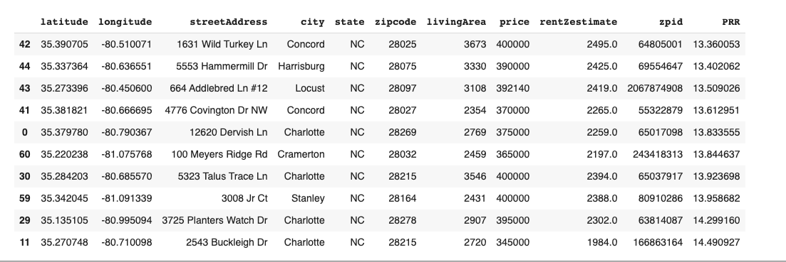
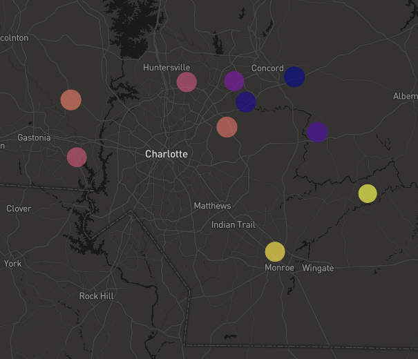

# UNCC FinTech Bootcamp Capstone Project

## Analyzing Potential Real Estate Investments

The objective of this project is to use real estate data to find the optimal house for potential investment. The requirements for this on a personal level are that the house has to:
1. Be in the Charlotte Metropolitan Area
2. Have a sale price between 250,000 and 400,000 dollars
3. Have a square footage of atleast 2,250
4. Have a good price to rent ratio which makes the investment valuable

### Using the Zillow API to get data

**The process for getting the API Data and using it was as follows** 
1. Making API requests for each county in the Charlotte Metro Area
2. Requesting House Listings that match the criteria 
3. Putting the response into JSON
4. Putting the JSON data into dataframes and concatenating them all into one dataframe
5. Using this combined dataframe to get a list of Zillow IDs
6. Looping through all of the Zillow IDs and getting information for each listing
7. Using the rent Zestimate and the listing price to calculate the price to rent ratio and adding it to the dataframe
8. Sorting the dataframe by the price to rent ratio
9. Keeping the top 10 and plotting them on a map using Mapbox

### Results

#### Combined Listing Dataframe

#### Map of the Listings. 
The color represents the price to rent ratio, ranging from blue being the most favorable to yellow being the least favorable.
The size represents the price of the house with the higher price meaning a larger circle on the map

